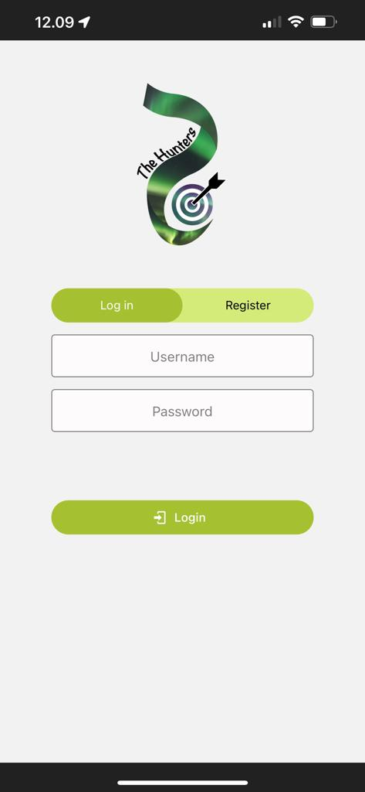
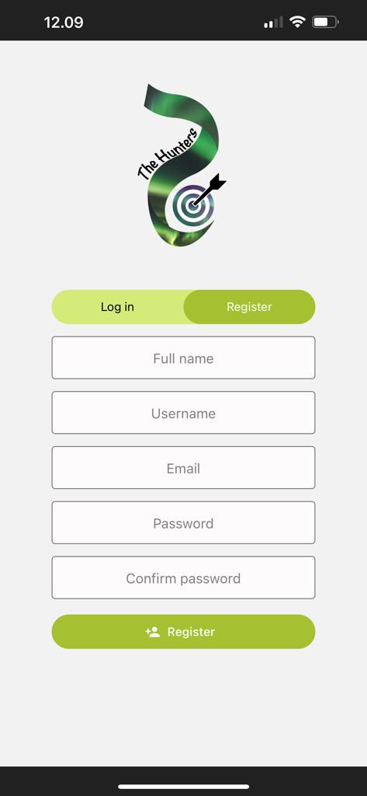
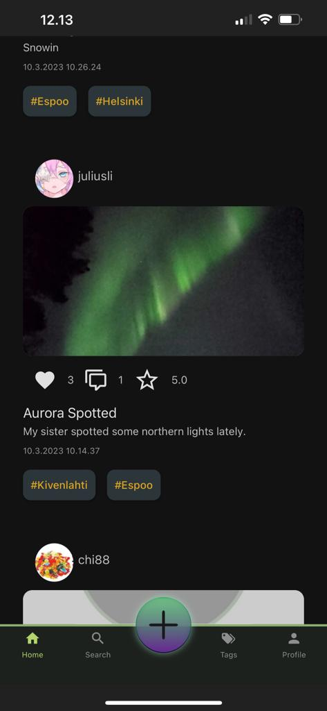
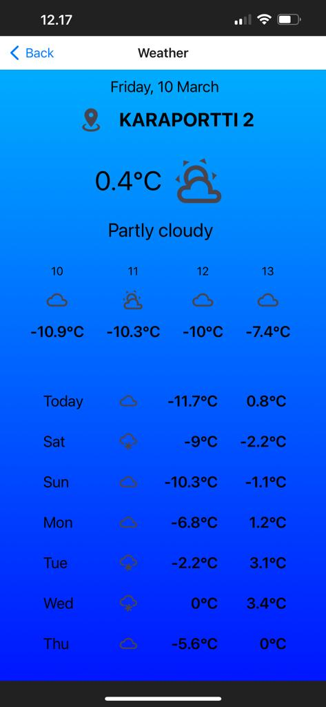
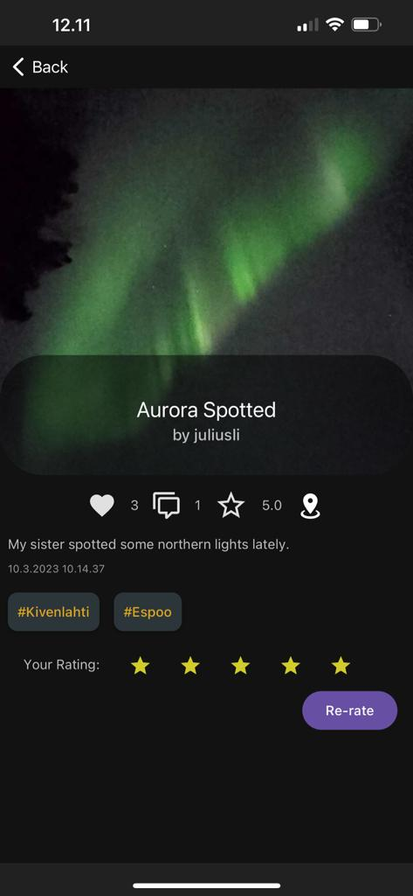
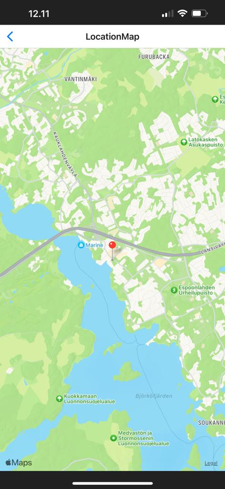
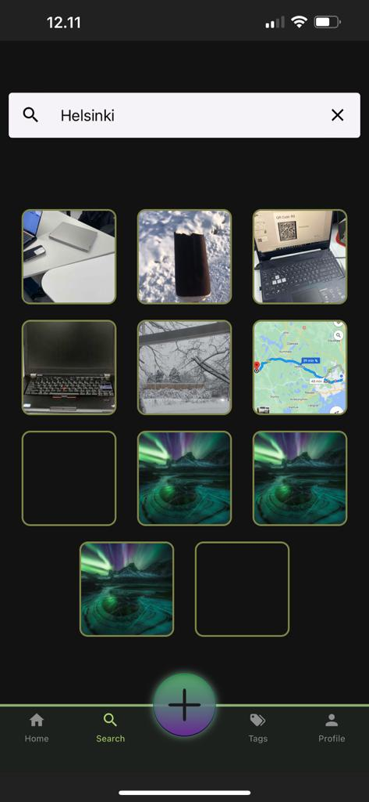
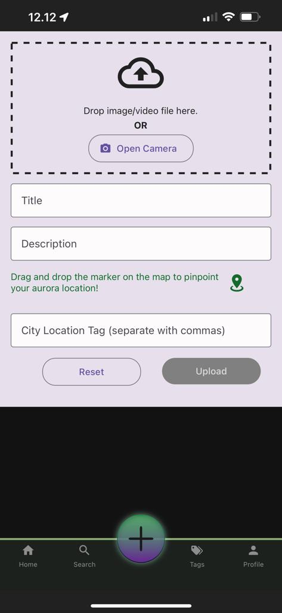
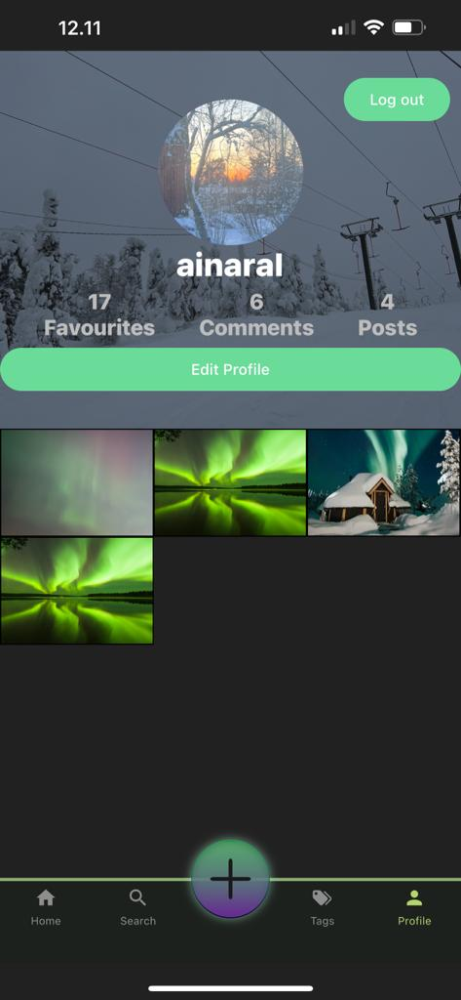
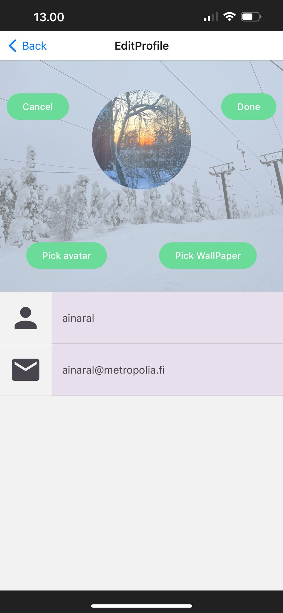

# Aurora Hunting

Aurora Hunting is a mobile application available on both iOS and Android platforms under Metropolia University Of Applied Sciences.
It allows users to share their own media of the aurora, obtain location information and weather updates, and engage with other users through comments, liking and rating.
The primary goal of this app is to unite aurora enthusiasts and foster a community that supports the app.

The app caters to individuals who enjoy outdoor activities, without any age restrictions.

## Contributors:

1. Giao Ngo
2. Tai Nguyen
3. Ainara Larrañaga Flores

## Table of content:

- [Features](#features)
- [Technologies](#technologies)

## Features:

1. **Register, Login, Logout**: By registering and logging in, users can become Aurora Hunters within the app.
2. **View, Post, Edit, Delete aurora media**: The user possesses complete control over their own posts, including the ability to upload, edit, and delete them.
3. **Search aurora media**: Users have the capability to search for aurora posts within the app by using keywords in either the title or description of the post.
4. **View, Edit profile**: Users can access their personal profile within the app, which displays their activity statistics and list of posted media. Additionally, users have the option to edit their profile as desired
5. **View, Delete comments**: The user has the ability to both add and delete their own comments within the app.
6. **Add, Remove liking and Add, Remove rating**: Within the app, users can express their appreciation for posts by liking them and rating them on a scale of 1 to 5 stars.
7. **Location map**: The app provides users with a map feature, which allows them to check the location of auroras by the location tags.
8. **Weather**: Users can also check the weather of the location tag within the app.
9. **Tags**: Users can check the tags within the app.
10. **Extra featured applied based on teacher feedback**:

- Open In-phone camera app in Upload screen: Integrate the in-phone camera app with the Upload screen, allowing users to capture photos that are automatically attached to the screen for uploading.
- Pull-to-refresh: Refresh the view by dragging the screen downwards

## Technologies

Develop a React Native application using the Expo CLI.

## App Promote Trailer

## App UI Screenshots

    
    
    
    
    
    
    
    
    
    
    

## Full-feature-reviewed Video (click to play)

